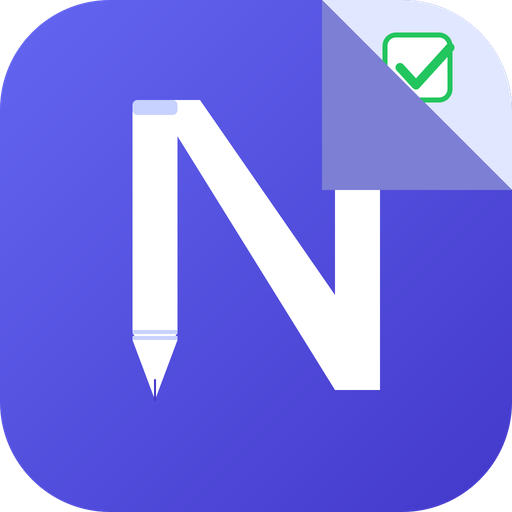
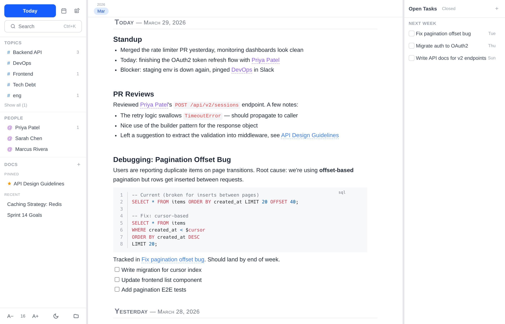

<p align="center">
  
</p>

<h1 align="center">NslNotes</h1>

<p align="center">A local-first, plain-text knowledge tool centered on time-ordered notes, first-class tasks, and a unified topic system. Built to replace daily LogSeq and Obsidian usage with a single opinionated workflow.</p>

<p align="center">
  
</p>

## Overview

NslNotes is a personal knowledge tool where the daily note is the center of gravity. Everything else — tasks, docs, topics, people — orbits it naturally.

- **Plain text, always.** Every file is human-readable markdown with YAML frontmatter. No database, no lock-in.
- **Time is the primary axis.** The journal is home. An infinite reverse-chronological scroll with today at the top.
- **Capture first, structure later.** Inline TODOs can be promoted to full task files when they earn it.
- **Context without modes.** A fixed three-column layout (sidebar, editor, task panel) with shared topics surfacing related content automatically.

### Entity Model

| Entity | Storage | Description |
|--------|---------|-------------|
| Note | `notes/YYYY-MM-DD.md` | Daily notes and named notes (meetings, sessions) |
| Task | `tasks/slug.md` | Structured work items with status, due date, topics |
| Doc | `docs/slug.md` | Standalone reference documents |
| Topic | Inline `#topic` / `@person` | Cross-cutting organizational layer, no registration needed |

## Tech Stack

- **Runtime**: [Tauri v2](https://v2.tauri.app/) (Rust backend) + [SolidJS](https://www.solidjs.com/) frontend
- **Editor**: [TipTap](https://tiptap.dev/) (ProseMirror)
- **Styling**: Tailwind CSS v4
- **Build**: Vite
- **Testing**: Vitest (unit), Playwright (e2e)

## Prerequisites

### With Nix (recommended)

The project includes a Nix flake that provides the complete development environment — Rust toolchain, Node.js, Tauri system dependencies (GTK, WebKit, etc.), and Playwright browsers. No manual dependency installation needed.

```bash
# Enter the dev shell (or use direnv)
nix develop

# Install frontend dependencies
npm install

# Run as native desktop app
npm run tauri dev
```

### Without Nix

- [Node.js](https://nodejs.org/) (v20+)
- [Rust](https://www.rust-lang.org/tools/install) (stable)
- Tauri v2 system dependencies — see the [Tauri prerequisites guide](https://v2.tauri.app/start/prerequisites/)

## Development

### Tauri (native desktop)

```bash
npm run tauri dev
```

Runs the SolidJS frontend via Vite on `:1420` and opens a native Tauri window. File operations go through Rust commands in `src-tauri/`. Requires the Rust toolchain and Tauri system dependencies (GTK, WebKit, etc.).

### Web (browser)

```bash
npm run dev:web
```

Runs Vite on `:3000` with an API plugin that provides file operations as HTTP endpoints — no Rust needed. Good for frontend-only work.

Both modes share the same frontend code via a runtime abstraction layer (`src/lib/runtime.ts`) that routes calls to either Tauri IPC or the web API.

## Production Builds

### Native desktop

```bash
npm run tauri:build     # Build release binary (no installer)
npm run tauri:install   # Install binary + desktop integration
```

Builds a release binary without creating platform installers. The install script detects your OS and places the binary plus desktop integration files (`.desktop` file on Linux, `.app` bundle on macOS, Start Menu shortcut on Windows).

> **macOS note:** The app is not code-signed, so Gatekeeper will block it on first launch. Right-click the app and choose **Open**, or run `xattr -cr ~/Applications/NslNotes.app`.

### Standalone web server

```bash
npm run web:build       # Build the web server binary
npm run web:install     # Build, install binary, and start as a service
```

Builds the frontend with Vite and compiles an Axum-based web server (`nslnotes-web` crate) with the assets embedded. The install script places the binary and registers a user service (systemd on Linux, launchd on macOS, scheduled task on Windows) that runs on login and serves on `http://localhost:3000`. Use `npm run web:serve` during development to build and run in one step.

### NixOS

```bash
nix run                   # Build and run desktop app directly
nix run .#web              # Build and run web server directly
nix profile install .      # Install desktop app to your Nix profile
nix profile install .#web  # Install web server binary

# After installing the web server, enable and start the service:
systemctl --user enable --now nslnotes-web
```

## Available Scripts

| Command | Description |
|---------|-------------|
| `npm run tauri dev` | Run as native Tauri desktop app (Vite on :1420) |
| `npm run dev:web` | Run in browser with Vite API plugin (Vite on :3000) |
| `npm run tauri:build` | Build release binary (no installer) |
| `npm run tauri:install` | Install binary + desktop integration for current OS |
| `npm run web:build` | Build frontend + compile standalone web server |
| `npm run web:install` | Build, install binary, and start as a user service |
| `npm run web:serve` | Build and run the standalone web server |
| `npm run typecheck` | Run TypeScript type checking |
| `npm run lint` | Lint source files |
| `npm run lint:fix` | Lint and auto-fix |
| `npm run format` | Format source files with Prettier |
| `npm run test` | Run unit tests (Vitest) |
| `npm run test:e2e` | Run end-to-end tests (Playwright) |

## Configuration

Settings are stored in `~/.config/nslnotes/settings.json`. To use a custom settings file (useful for testing or multiple instances), set the `NSLNOTES_SETTINGS` environment variable:

```bash
# Use a custom settings file in any mode
NSLNOTES_SETTINGS=~/test-settings.json npm run tauri dev
NSLNOTES_SETTINGS=~/test-settings.json npm run dev:web
NSLNOTES_SETTINGS=~/test-settings.json npm run web:serve
```

The web server port can be configured in `settings.json` (default `3000`). CLI `--port` overrides it:

```jsonc
{
  "rootPath": "/home/user/nslnotes",
  "webPort": 8080
}
```

```bash
# Port priority: --port flag > settings.json webPort > 3000
npm run web:serve -- --port 9090
```

## Data Directory

NslNotes reads and writes plain markdown files from a user-selected directory:

```
~/nslnotes/
  notes/          # Daily and named notes
  tasks/          # Task files
  docs/           # Reference documents
  topics.yaml     # Optional topic labels and metadata
```

All files use YAML frontmatter for metadata. The app rebuilds its index from disk — the files are always the source of truth.

## License

MIT
